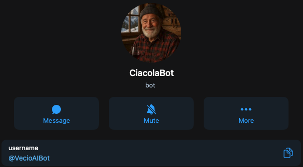

# 🧓 VecioBot – Telegram Bot in Dialetto Trentino


**VecioBot** è un bot Telegram che risponde in autentico **dialetto trentino**, come se stessi parlando con un vero "vecio da stua" davanti a una stufa accesa, tra un bicér de vin e due ciacole.

Sfrutta la potenza di un **modello LLM locale** (come LLaMA 3 via [Ollama](https://ollama.com)) per generare risposte **naturali, calde e dialettali**, ispirate al linguaggio parlato nei paesi di montagna del Trentino.

---

## 📸 Screenshot

<p align="center">
  
</p>

---

## 🚀 Funzionalità principali

- ✅ Risposte generate in **dialetto trentino autentico**
- 🧠 Basato su **LLaMA 3 (via Ollama)** – tutto gira **in locale**
- 💬 Bot Telegram pronto all’uso con `python-telegram-bot`
- 🗂️ Prompt personalizzato per simulare il tono di un vecchio trentino
- 🔁 Facile da personalizzare, estendere o integrare con un dizionario CSV

---

## 📦 Requisiti

- Python 3.8+
- Telegram Bot Token
- [Ollama](https://ollama.com) installato e funzionante
- Modello LLM scaricato (es. `llama3`)

---

## 🔧 Installazione

```bash
git clone https://github.com/tuo-username/vecio-bot.git
cd vecio-bot
python3 -m venv venv
source venv/bin/activate
pip install -r requirements.txt
```

---

## 🧠 Modello LLaMA

Installa e avvia Ollama:

```bash
curl -fsSL https://ollama.com/install.sh | sh
ollama pull llama3
ollama run llama3
```

Ollama risponderà alle richieste su `http://localhost:11434`.

---

## 🤖 Configura il bot Telegram

1. Vai su Telegram e cerca **[@BotFather](https://t.me/BotFather)**
2. Crea un nuovo bot con `/newbot`
3. Copia il **token** e inseriscilo nel tuo `bot.py`:
   ```python
   BOT_TOKEN = '123456789:ABCdefGHI_jklMNOpqrSTUvwxYZ'
   ```

---

## ▶️ Avvio del bot

Assicurati che Ollama sia attivo e il modello caricato, poi esegui:

```bash
python bot.py
```

Il bot inizierà ad ascoltare i messaggi e risponderà in dialetto trentino.

---

## 🧾 Esempio di risposta

**Domanda:** "Cosa fai oggi?"  
**Risposta:** "Gnente de che, ho spazzà fora la stala e po’ son restà a ciacolar co’ la Rita."

---

## 🛠️ Personalizzazione

### Prompt personalizzato

Nel file `bot.py`, puoi modificare il prompt all’interno di `PROMPT_TEMPLATE` per cambiare il tono o aggiungere nuove frasi tipiche del tuo dialetto o zona.

### Uso di un dizionario CSV (opzionale)

Puoi creare un file `vocabolario.csv` con:

```csv
Italiano,Dialetto
ciao,ciao
come,come che
bene,benòn
```

E integrarlo nel codice per traduzioni parola-per-parola (sconsigliato per frasi complesse).

---

## 🧠 Avvio automatico (opzionale)

Per far partire il bot all’avvio del server, puoi usare `systemd`. Esempio file:

```ini
[Unit]
Description=VecioBot - Telegram bot trentino
After=network.target

[Service]
ExecStart=/percorso/del/venv/bin/python /percorso/vecio-bot/bot.py
WorkingDirectory=/percorso/vecio-bot
Restart=always

[Install]
WantedBy=multi-user.target
```

Salvalo in `/etc/systemd/system/veciobot.service`.

---

## 📬 Contatti

Se vuoi contribuire, segnalare miglioramenti o anche solo dire *"Benòn!"*, sentiti libero di aprire una issue o fare una pull request.

---

**VecioBot** – El bot che parla come ‘na volta.
